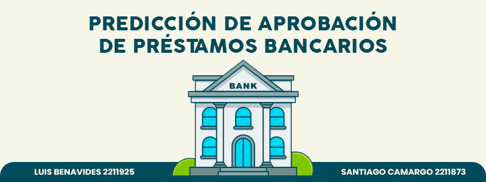

# Proyecto IA1 | Predicción de aprobación de préstamos bancarios

## Autores
Santiago Camargo Ardila - 2211873

Luis Carlos Benavides Torres - 2211925

## Objetivo
Predecir con precisión y eficiencia la aprobación de un préstamo bancario a partir del análisis del perfil del solicitante.

## Dataset
Disponible en [Kaggle](https://www.kaggle.com/datasets/lorenzozoppelletto/financial-risk-for-loan-approval).

## Modelos
DecisionTree, RandomForest, SVM, Redes Neuronales Densas, K-means, DBSCAN, PCA.

## Enlaces
- [Código fuente (Notebook)](./proyecto_ia_2025_1.ipynb)
- [Repositorio en GitHub](https://github.com/scamargo27/Proyecto_IA_2025_1)
- [Video explicativo](https://youtu.be/5zTswH_xA9I)
